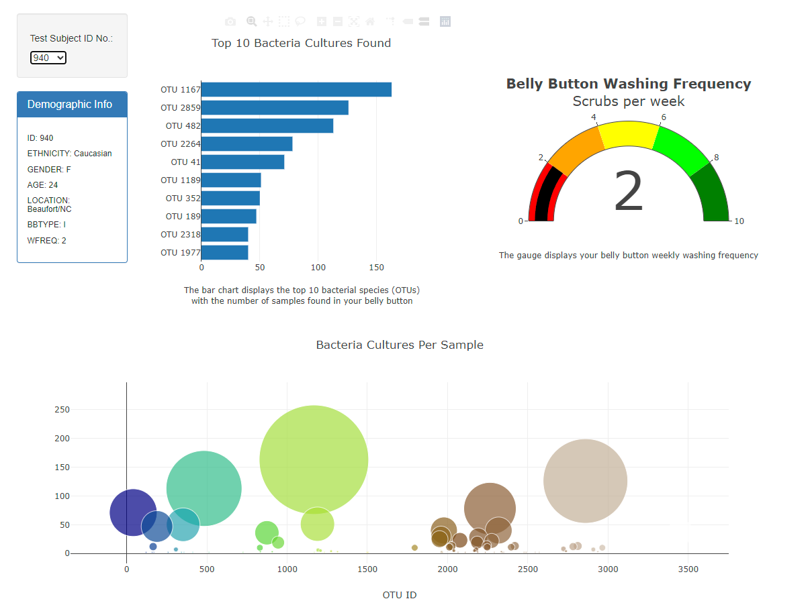

# Belly_Button_Biodiversity

## Project Overview
This project focuses on building an interactive dashboard to visualize the bacterial species living in the navel of candidates for research about meat protein synthesis from human bacteria. 

You can visit my Dashboard @ https://cmenegoli.github.io/belly-button-challenge/

## Resources
- Data Source: [Belly button samples data]

- Software: HTML/CSS, JavaScript, Visual Studio Code 1.49.1, BootStrap 3.3.7, D3, Plotly 4.11
